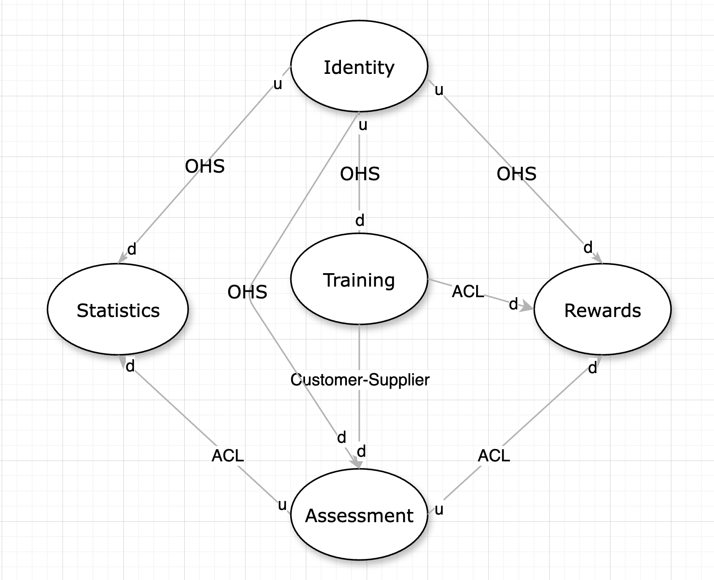

# Стратегическое проектирование

### System

Цифровой тренажер для подготовки ко сдаче языкового экзамена для школы по ее формату. Цель - создать персонализированную практику для пользователя, чтобы он в комфортном для него ритме мог подготовиться. Система предоставляет задание, проверяет и возвращает обратную связь.

### Domains:

#### Core:

***Training*** - ключевой домен. Пользователь приходит за тренировкой, приближенной к реальным заданиям для экзамена, может ознакомиться со структурой вопросов, попробовать их решить - все в удобное для него время, без лишнего стресса и дополнительных коммуникаций. Ценность продукта в способности быстро предоставлять пользователю релевантные задания, близкие к реальным, а также предоставление конструктивного фидбека по результатам выполнения задания.

#### Supporting:

***Statistics*** - пользователь может отслеживать свой прогресс, для учащегося очень важно видеть, что его работа приносит результаты.

***Rewards*** - пользователь имеет возможность получать “достижения”, что превращает его обучение и подготовку к экзамену в игровой процесс.

#### Generic:

***Identity*** - работа с аутентификацией (регистрация пользователя, привязка сессии к устройству).

### Bounded Contexts

***TrainingContext***

Ответственность контекста - отправка пользователю релевантного задания, получение выполнения задания.

***AssessmentContext***

Ответственность контекста - проверка полученного выполненного задания, предоставление обратной связи.

***StatisticsContext***

Ответственность контекста - подсчет статистики по результатам выполнения, отрисовка графиков.

***RewardsContext***

Ответственность контекста - награда пользователя за действия в системе.

***IdentityContext***

Ответственность контекста - предоставление пользователю доступов к тренировкам и личному кабинету со статистикой.

Бизнес-понятия:

Пользователь

- в TrainingContext это субъект, запускающий попытку (задания, экзамена)
- в AssessmentContext это субъект, выполнивший задание
- в StatisticsContext это субъект, которому принадлежит результат
- в RewardsContext это субъект, которому принадлежит достижение
- в IdentityContext это субъект, которому принадлежит сессия в сочетании с определенным устройством

Задача

- в TrainingContext это объект, содержащий в себе информацию об уровне, модуле, текст задания, вопросы для пользователя
- в AssessmentContext это объект, содержащий в себе информацию о том, что конкретно должно быть проверено
- в StatisticsContext это объект, содержащий в себе информацию об уровне и модуле, о времени выполнения

Ответ

- в TrainingContext это то, что пользователь отправляет на проверку
- в AssessmentContext это то, что необходимо проверить по определенным критериям

### Context Map

Identity → Остальные контексты: OHS - Identity отдает свою модель вне зависимости от потребителей, но ему необходимо поддерживать удобный и стабильный API.

Training → Assessment: Training контекст отправляет его на проверку в Assessment контекст, Assessment должен вернуть результат, подстроенный под нужды Training.

Training → Rewards: для Training не важно, что должен получать Rewards, он оправляет “как есть”. Rewards переводит данные в удобную для себя модель.

Assessment → Rewards: аналогично Training → Rewards.

Assessment → Statistics: аналогично Training → Rewards.

### Glossary

***Level***

- Определение: уровень языка, для проверки которого загружаются задания. Может принимать значения от A1 (базовый) до B2 (продвинутый)

***Task***

- Определение: единица задания, принадлежащая к одному из четырех модулей (Module). Задание имеет текстовый формат. Содержит в себе само задание, инструкции по выполнению и, в зависимости от типа, может содержать в себе набор вопросов и ответов
- Недопустимые синонимы: TaskRun, TaskSubmission, TaskResult, Question, Module, Exam

***Question***

- Определение: единица вопроса, принадлежит заданию (Task)
- Недопустимые синонимы: Task, Module, Exam

***Answer***

- Определение: выбранный или написанный пользователем вариант ответа для задания (Task)
- Недопустимые синонимы: Result, Verdict

***TaskRun***

- Определение: runtime-попытка на прохождение задания, содержит в себе артефакты запуска прохождения задания (статус, айди пользователя, время запуска)
- Недопустимые синонимы: Task, TaskSubmission

***TaskSubmission***

- Определение: пользовательское выполнение задания, которое он отправляет на проверку
- Недопустимые синонимы: Result, Answer, Verdict

***Result***

- Определение: исторический результат проверки TaskSubmission, сохраняется в базе данных
- Недопустимые синонимы: TaskSubmisson, Answer, Verdict

***Verdict***:

- Определение: итог проверки TaskSubmission, имеет два состояния - ready и not_ready (положительный и отрицательный)
- Недопустимые синонимы: Answer, Result, TaskSubmission

***Module***

- Определение: конфигурация для генерации задач, в которой выставлены ограничения по количеству и типу задач, их уровень
- Недопустимые синонимы: Task, Exam

***Exam***

- Определение: конфигурация для генерации модулей, в которой выставлено ограничение по уровню для генерации модулей
- Недопустимые синонимы: Task, Module

## Value Objects
В домене можно выделить следующих кандидатов на представление их в виде VO:

- Email (вместо string), инварианты:
    - Должен быть не пустым
    - Должен быть корректным (проверка по регулярному выражению)
- QuestionKey (вместо string), инварианты:
    - Должен быть не пустым
    - Должен начинаться с определенного префикса
- VerificationCode (вместо string), инварианты:
    - Должен быть не пустым
    - Должен иметь определенный формат
